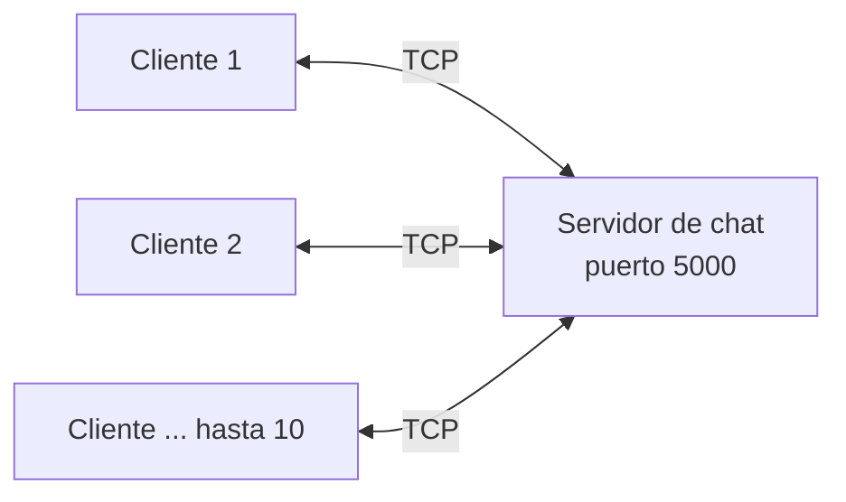
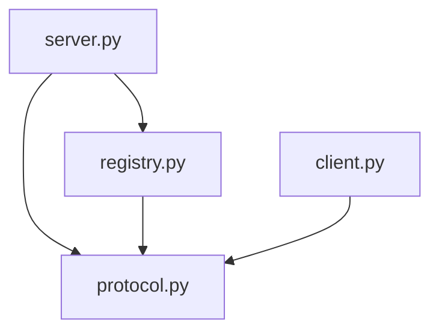
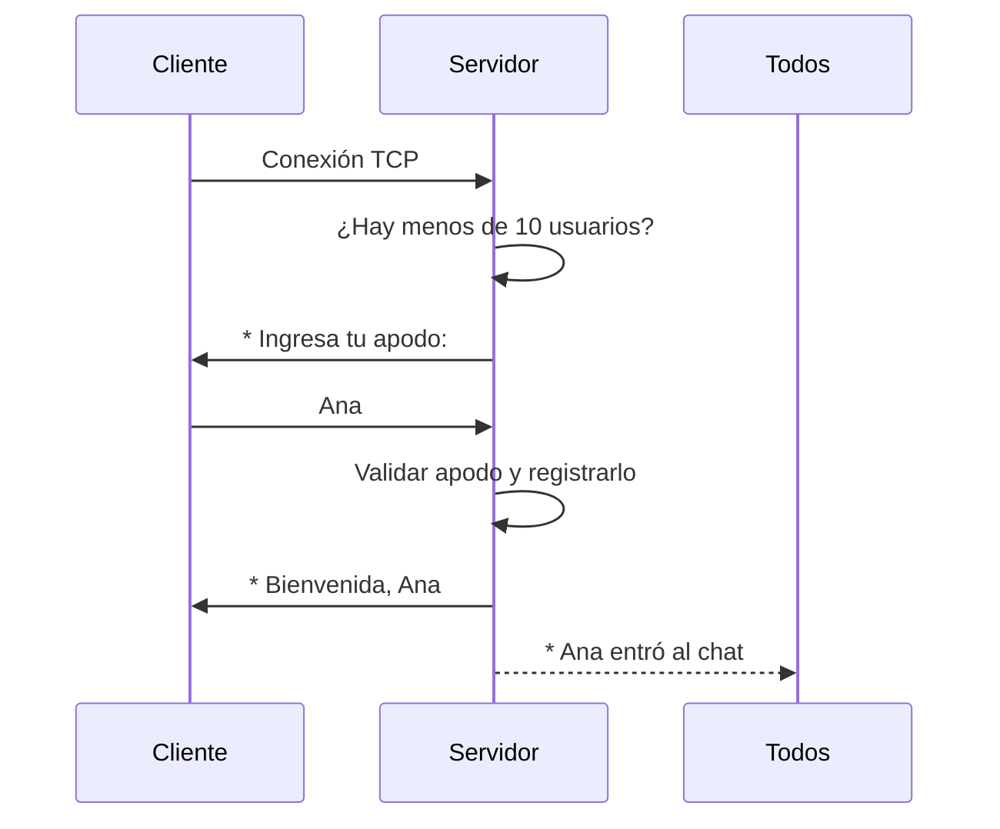
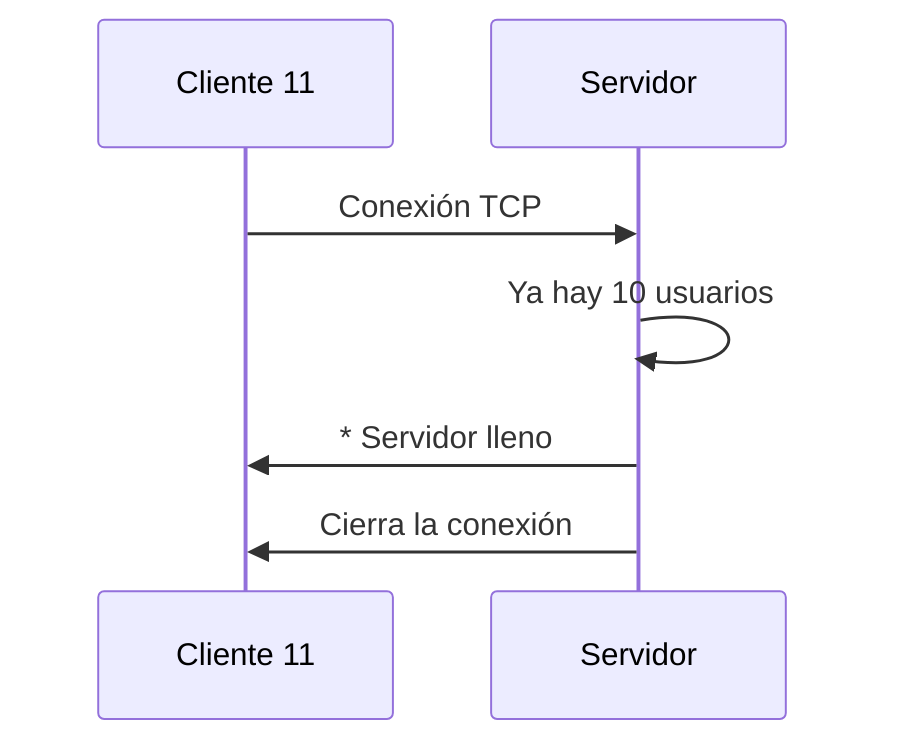

# Arquitectura

## 1. Visión general
Arquitectura cliente-servidor sobre TCP. Un único servidor centraliza las
conexiones y retransmite los mensajes; los clientes solo hablan con el servidor.



## 2. Componentes

| Módulo               | Responsabilidad                                                             | Toca la red |
|----------------------|-----------------------------------------------------------------------------|-------------|
| `src/protocol.py`    | Validar apodos y mensajes, dar formato a los mensajes, constantes (límites). | No          |
| `src/registry.py`    | `ClientRegistry`: lista de usuarios, límite de 10, apodos únicos, con `Lock`.| No          |
| `src/server.py`      | `ChatServer`: acepta conexiones, un hilo por cliente, difusión de mensajes.  | Sí          |
| `src/client.py`      | Cliente de consola: un hilo envía lo que se escribe, otro muestra lo recibido.| Sí         |



## 3. Modelo de concurrencia
- El **hilo principal** del servidor ejecuta el ciclo `accept()`.
- Por cada cliente aceptado se crea un **hilo** que atiende sus mensajes.
- El acceso a la lista de usuarios se protege con un `threading.Lock`.
- Para difundir un mensaje se toma una **copia** de la lista bajo el lock y se
  envía fuera de él, para que un cliente lento no bloquee a los demás.
- Si un envío falla, ese cliente se elimina del registro (RF-11).
- El cliente usa dos hilos para poder escribir y recibir a la vez (RF-12).

## 4. Protocolo de comunicación
Texto UTF-8, un mensaje por línea, terminado en `\n`.

| Dirección           | Formato                        | Ejemplo                           |
|---------------------|--------------------------------|-----------------------------------|
| Servidor → cliente  | `* <aviso>`                    | `* Ana entró al chat`             |
| Servidor → cliente  | `[apodo] texto`                | `[Ana] hola a todos`              |
| Cliente → servidor  | apodo (primera línea)          | `Ana`                             |
| Cliente → servidor  | texto libre                    | `hola a todos`                    |
| Cliente → servidor  | `/salir`                       | `/salir`                          |

## 5. Flujos principales

### Conexión exitosa


### Servidor lleno


## 6. Decisiones de diseño
| Decisión                        | Motivo                                                        |
|---------------------------------|---------------------------------------------------------------|
| Hilos en lugar de `asyncio`     | Más simple de implementar y depurar para un proyecto académico.|
| Lógica separada de los sockets  | Permite pruebas unitarias sin red.                            |
| Protocolo de texto plano        | Se puede probar incluso con `nc` o `telnet`.                  |
| Límite verificado antes del apodo| El cliente 11 recibe el rechazo sin ocupar recursos (RF-05).  |
| Puerto configurable             | Evita conflictos y facilita las pruebas (RF-01).              |

## 7. Trazabilidad con los requisitos
| Requisitos                     | Componente                          |
|--------------------------------|-------------------------------------|
| RF-02, RF-03, RF-07, RF-08     | `protocol.py`                       |
| RF-04, RF-05                   | `registry.py` y `server.py`         |
| RF-01, RF-06, RF-09, RF-10, RF-11 | `server.py`                      |
| RF-12, RF-13                   | `client.py`                         |
| RNF-01, RNF-04                 | `protocol.py` y `server.py`         |

## 8. Estructura del repositorio
```
chat-tcp/
├── docs/        documentación
├── src/         protocol.py, registry.py, server.py, client.py
├── tests/       pruebas unitarias y de integración
└── README.md
```